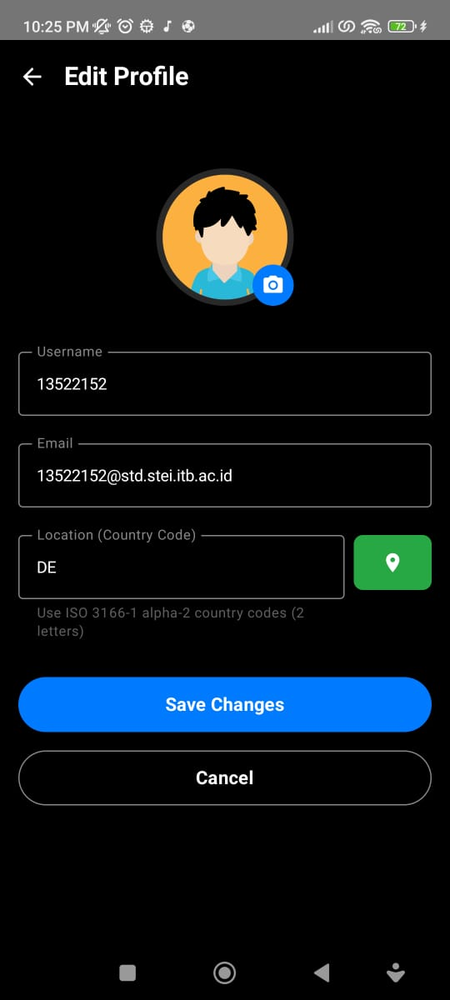
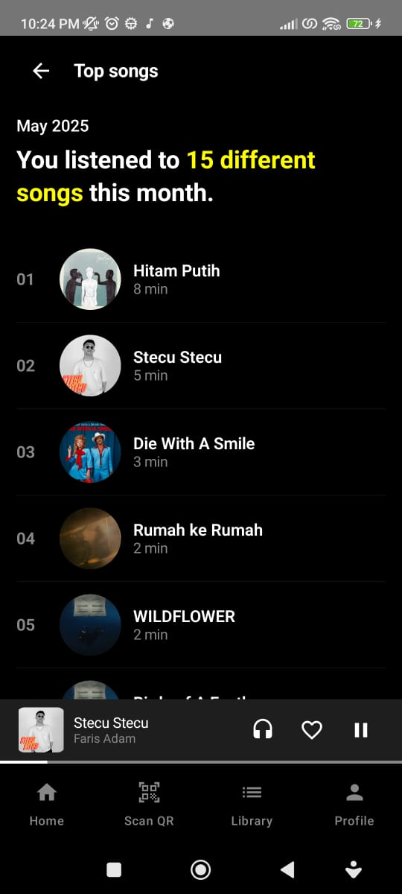

# if3210-tubes-mad-2025-if3210-2025-mad-kkb
# Purrytify

## Description
Purrytify is a modern music player application that allows users to browse, play, and manage their favorite songs. The app features a sleek user interface, album art display, playback controls, and the ability to like songs. It is built using Kotlin and Jetpack Compose, following modern Android development practices.

## Features

- **Library Screen:**  
  Browse your full song collection, filter by "All", "Liked", and "Downloaded" songs, and add new tracks.
- **Online Songs:**  
  Stream and browse songs available online directly from the app.
- **Download Online Songs:**  
  Download online songs for offline playback and manage your downloads within the app.
- **Sound Capsule (Analytics):**  
  View monthly analytics of your listening habits, including top artists, top songs, and more.
- **Notification Controls:**  
  Control playback directly from Android notifications.
- **Audio Routing and Output:**  
  Advanced options for selecting audio output and routing playback.
- **Share Songs via URL:**  
  Share your favorite songs with friends using direct URLs.
- **Share Songs via QR:**  
  Instantly share songs by generating and scanning QR codes.
- **Responsive Pages:**  
  The UI adapts to both portrait and landscape orientations.
- **MiniPlayer:**  
  Quickly control playback with play/pause, previous, and next buttons, and view the current song's cover, title, and artist.
- **Profile & Edit Profile:**  
  View and update your profile, and see your listening history and stats.
- **Song Recommendations:**  
  Get personalized song recommendations based on your listening habits.
- **Bottom Navigation & Sidebar:**  
  Seamless navigation between Home, QR Scanner, Library, and Profile screens.

---

## Libraries Used
The following libraries and tools are utilized in this project:
- **Jetpack Compose**: For building modern, reactive UIs with Kotlin.
  - `androidx.compose.material3:material3`
  - `androidx.compose.material:material-icons-extended`
  - `androidx.compose.ui:ui`
  - `androidx.compose.ui:ui-graphics`
  - `androidx.compose.ui:ui-tooling-preview`
  - `androidx.compose.ui:ui-tooling`
  - `androidx.compose.ui:ui-test-junit4`
  - `androidx.activity:activity-compose`
  - `androidx.navigation:navigation-compose`

- **Room Database**: Local data storage and management using SQLite with Kotlin.
  - `androidx.room:room-runtime`
  - `androidx.room:room-ktx`
  - `androidx.room:room-compiler`

- **Kotlin Coroutines & StateFlow**: For reactive state management and asynchronous programming.
  - `androidx.lifecycle:lifecycle-runtime-ktx`

- **Coil**: Fast, modern image loading for Android.
  - `io.coil-kt:coil-compose`

- **Glide**: Efficient image loading and caching.
  - `com.github.bumptech.glide:glide`
  - `com.github.bumptech.glide:compiler`

- **Hilt**: Dependency injection for easier code management and testing.
  - `com.google.dagger:hilt-android`
  - `com.google.dagger:hilt-compiler`
  - `androidx.hilt:hilt-navigation-compose`

- **Retrofit & OkHttp**: Making HTTP requests and handling APIs.
  - `com.squareup.retrofit2:retrofit`
  - `com.squareup.retrofit2:converter-gson`
  - `com.squareup.okhttp3:okhttp`
  - `com.squareup.okhttp3:logging-interceptor`

- **Security & Crypto**: Secure data storage and encryption.
  - `androidx.security:security-crypto`

- **Media & Audio**: Audio playback and media controls.
  - `androidx.media:media`
  - **Android MediaPlayer API** (built-in)

- **ZXing**: QR code generation and scanning.
  - `com.google.zxing:core`

- **Google Play Services**: Location services and APIs.
  - `com.google.android.gms:play-services-location`

- **CameraX**: Camera support for capturing images and video.
  - `androidx.camera:camera-camera2`
  - `androidx.camera:camera-lifecycle`
  - `androidx.camera:camera-view`

- **ML Kit**: Barcode and QR code scanning with machine learning.
  - `com.google.mlkit:barcode-scanning`

- **Accompanist**: Extra utilities for Compose, such as permissions.
  - `com.google.accompanist:accompanist-permissions`

- **iText PDF**: Generating and exporting PDF documents.
  - `com.itextpdf:itextpdf`

---

## Screenshots
Screenshots of the application can be found in the `screenshot/` folder.

---

## Team Work Distribution

| NIM        | Milestone 1                                       | Milestone 2|
|------------|---------------------------------------------------|------------|
| 13522123   | Login, Logout, Mini Player, Profile,Network Sensing | Sound Capsule(Analytics), Export analytics, Online Songs, Download Online Songs | 
| 13522151   | Library, Like Song, Login, Add Song,Home          | Share via URL, Share via QR, Responsivitas, Rekomendasi Lagu | 
| 13522152   | Add Song, Media Player, Navbar,Home               | Notification Controls, AudioRouting and Output Device, Edit Profile |

---

## Time Spent

# Milestone 1

| Name       | Preparation Time (hours) | Development Time (hours) | Total Time (hours) |
|------------|---------------------------|---------------------------|--------------------|
| 13522123  | 5                         | 25                        | 30                 |
|  13522151| 5                         | 25                           | 30                 |
|  13522152  | 5                         | 25                          | 30                 |

# Milestone 2

| Name       | Preparation Time (hours) | Development Time (hours) | Total Time (hours) |
|------------|---------------------------|---------------------------|--------------------|
| 13522123  | 2                         | 25                        | 27                 |
|  13522151| 2                         | 25                           | 27                 |
|  13522152  | 2                         | 25                          | 27                 |
---
