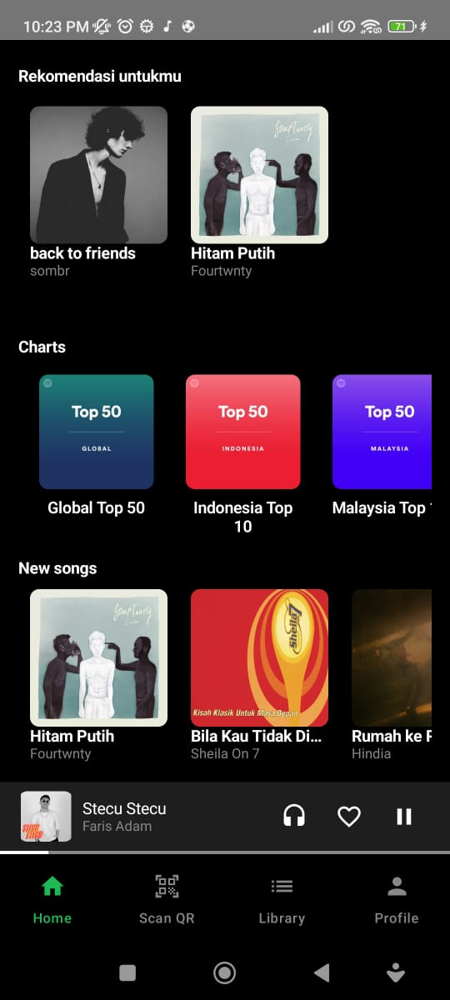

# if3210-tubes-mad-2025-if3210-2025-mad-kkb
# Purrytify

## Description
Purrytify is a modern music player application that allows users to browse, play, and manage their favorite songs. The app features a sleek user interface, album art display, playback controls, and the ability to like songs. It is built using Kotlin and Jetpack Compose, following modern Android development practices.

---

## Libraries Used
The following libraries and tools are utilized in this project:
- **Jetpack Compose**: For building the UI.
- **Room Database**: For local data storage and management.
- **Kotlin Coroutines**: For asynchronous programming.
- **StateFlow**: For reactive state management.
- **Coil**: For loading and displaying images.
- **Hilt**: For dependency injection.
- **MediaPlayer API**: For audio playback.
- **Navigation Compose**: For handling navigation between screens.

---

## Screenshots
Screenshots of the application can be found in the `screenshot/` folder.

---

## Team Work Distribution

| NIM   | Task                                                                 |
|------------|----------------------------------------------------------------------|
| 13522123 | Login, Logout, Mini Player, Profile,Network Sensing |
| 13522151   | Library, Like Song, Login, Add Song,Home|
| 13522152   | Add Song, Media Player, Navbar,Home|

---

## Time Spent

| Name       | Preparation Time (hours) | Development Time (hours) | Total Time (hours) |
|------------|---------------------------|---------------------------|--------------------|
| 13522123  | 5                         | 25                        | 30                 |
|  13522151| 5                         | 25                           | 30                 |
|  13522152  | 5                         | 25                          | 30                 |

---
